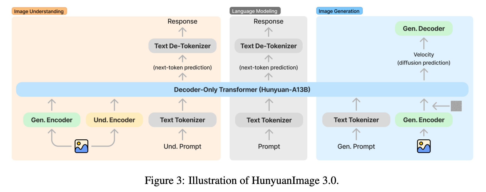

# Finetune HunyuanImage-3.0

[](https://www.gnu.org/licenses/agpl-3.0)
[](https://www.python.org/downloads/)
[](https://github.com/PhotonAISG/hunyuan-image3-finetune)
[](https://github.com/PhotonAISG/hunyuan-image3-finetune/fork)

This repository contains training scripts for fine-tuning HunyuanImage-3.0 models. Designed to work with the official model at: https://github.com/Tencent-Hunyuan/HunyuanImage-3.0.git

> **Note:** This repo contains only the training scripts. Please refer to the official repository for the inference code, and documentation. 
\
\
This repository is **not** the official training scripts for HunyuanImage-3.0 and is **not affiliated** with Tencent's Hunyuan team. These scripts are independently developed for research and educational purposes.
For the official Hunyuan Image 3.0 repository (only has inference code), please visit: [HunyuanImage-3.0 Official Repository](https://github.com/Tencent-Hunyuan/HunyuanImage-3.0.git)



<p align="center">
<em>Overview of the HunyuanImage-3.0 architecture (image source: Hunyuan Image 3 Technical Report)</em>
</p>

Unified vision-language models capable of both understanding and generation are emerging as the dominant paradigm in multimodal AI. **HunyuanImage-3.0** is currently the largest open-source unified model (an 80B MoE model), demonstrating exceptional performance across both tasks. While the [official repository](https://github.com/Tencent-Hunyuan/HunyuanImage-3.0.git) focuses on inference, this project empowers the community to train and fine-tune this state-of-the-art model. By providing a comprehensive pipeline built on Hugging Face Trainer, DeepSpeed, and PEFT, we enable efficient experimentation and customization on your own datasets.


## 📋 Table of Contents

<details>
    <summary>Table of Contents</summary>
    <ol>
        <li><a href="#-trained-loras">Trained LoRAs</a></li>
        <li><a href="#-news">News</a></li>
        <li><a href="#-overview">Overview</a></li>
        <li><a href="#-system-requirements">System Requirements</a></li>
        <li><a href="#-quick-start">Quick Start</a></li>
        <li><a href="#-training-scripts">Training Scripts</a></li>
        <li><a href="#-data-format">Data Format</a></li>
        <li><a href="#%EF%B8%8F-image-dataset-preparation">Image Dataset Preparation</a></li>
        <li><a href="#%EF%B8%8F-data-preparation-utilities">Data Preparation Utilities</a></li>
        <li><a href="#-dataset-module">Dataset Module</a></li>
        <li><a href="#%EF%B8%8F-configuration-files">Configuration Files</a></li>
        <li><a href="#-data-directory-structure">Data Directory Structure</a></li>
        <li><a href="#-training-modes">Training Modes</a></li>
        <li><a href="#-training-tips">Training Tips</a></li>
        <li><a href="#-advanced-features">Advanced Features</a></li>
        <li><a href="#-example-workflows">Example Workflows</a></li>
        <li><a href="#%EF%B8%8F-known-issues">Known Issues</a></li>
        <li><a href="#-license">License</a></li>
        <li><a href="#-citation">Citation</a></li>
        <li><a href="#-acknowledgment">Acknowledgment</a></li>
    </ol>
</details>

## 👥 Contributors
This repo is developed and maintained by Pixo team (official@pixo.video). For inqueries, you can also reach out to yangzhang@u.nus.edu.

<!-- <a href="https://github.com/PhotonAISG/hunyuan-image3-finetune/graphs/contributors">
  
</a> -->
<div style="display: flex; gap: 2px;">
  <a href="https://github.com/PhotonAISG">
    
  </a>
  
  <a href="https://github.com/YourUsername">
    
  </a>
  <a href="https://github.com/YourUsername">
    
  </a>
  <a href="https://github.com/YourUsername">
    
  </a>
</div>

## 🎨 Trained LoRAs

| Model | Description | Link |
|-------|-------------|------|
| HunyuanImage-3.0-Naruto-Style-Adapter | Naruto anime style | [🤗 HuggingFace](https://huggingface.co/pixosg/HunyuanImage-3.0-Naruto-Style-Adapter) |

> Have a trained LoRA to share? Open a PR to add it here!

## 🔥🔥🔥 News

- **[2025-12]** Initial release of HunyuanImage-3.0 training scripts


## 🔍 Overview

We provide a simple training pipeline for HunyuanImage-3.0 based on the Hugging Face Trainer.

The training framework supports two training modes:
- **Text-only fine-tuning**: Supervised fine-tuning for language modeling
- **Image generation training**: Text-to-image generation with flow matching

> **Note:** Image understanding (MMU) pipeline is not yet implemented.


## 💻 System Requirements

Below are the minimum hardware requirements for training HunyuanImage-3.0 with **LoRA** when the base model is loaded in **bf16** precision:

| Training Mode | Image Size | Minimum VRAM |
|---------------|------------|--------------|
| Text-only | N/A | ≥ 3 × 80GB |
| Image Generation | 256×256 | ≥ 3 × 80GB |
| Image Generation | 512×512 | ≥ 4 × 80GB |
| Image Generation | 768×768 | ≥ 6 × 80GB |
| Image Generation | 1024×1024 | ≥ 8 × 80GB |

> **Note:** Full model training requires significantly more VRAM.


## 🚀 Quick Start

### Prerequisites

```bash
# Install dependencies
pip install -r requirements.txt
```

### Basic Usage

1. **Download the base model** from the [official repository](https://github.com/Tencent-Hunyuan/HunyuanImage-3.0.git)
2. **Prepare your training data** (see [Data Preparation](#%EF%B8%8F-data-preparation-utilities))  
3. **Configure your training script** (see [Training Scripts](#-training-scripts))  
4. **Run training**:
   ```bash
   # For text-only fine-tuning
   bash train.sh
   
   # For image generation training
   bash train_image.sh
   
   # For Slurm clusters
   bash train_slurm.sh
   ```

## 📜 Training Scripts

### Main Training Script

**`train_multimodal.py`**
- Main training script for text-only and image generation training
- Built on Hugging Face Transformers Trainer
- Custom trainer handles both text and image generation losses

Key arguments:
- `--model_name_or_path`: Path to pretrained model
- `--train_data_file`: Path to training data (JSONL format)
- `--output_dir`: Directory to save checkpoints
- `--use_lora`: Enable LoRA fine-tuning
- `--train_text_only`: Enable text-only training mode
- `--train_image_generation`: Enable image generation training
- `--sequence_template`: Template type ("instruct" or "pretrain")

### Shell Scripts

**`train.sh`**
- Example script for text-only fine-tuning
- Configured for 2 GPUs with DeepSpeed
- Uses Alpaca dataset by default
- Supports LoRA with configurable rank and alpha

Configuration highlights:
```bash
TRAIN_TEXT_ONLY=true
TRAIN_IMAGE_GENERATION=false
USE_LORA=true
LORA_RANK=64
```

**`train_image.sh`**
- Example script for image generation training
- Supports text-to-image generation tasks
- Includes image-specific configurations (size, ratio, etc.)
- Uses custom loss weighting schemes

Configuration highlights:
```bash
TRAIN_IMAGE_GENERATION=true
IMAGE_BASE_SIZE=512
IMAGE_RATIO="1:1"
```

**`train_slurm.sh` / `train_image_slurm.sh`**
- Slurm cluster versions of the training scripts
- Includes SLURM job configuration
- Supports multi-node training

## 📄 Data Format

Training data should be in JSONL format (one JSON object per line). The dataset supports three types:

### 1. Text-only (Language Modeling)

Standard conversation format for supervised fine-tuning:

```json
{
    "type": "text_only",
    "messages": [
        {"role": "system", "content": "You are a helpful assistant."},
        {"role": "user", "content": "What is AI?"},
        {"role": "assistant", "content": "AI stands for Artificial Intelligence..."}
    ]
}
```

### 2. Image Generation - Instruct Style

For training with system prompts and multi-turn conversations. The `gen_image` tokens are automatically appended after the assistant's text response:

```json
{
    "type": "image_generation",
    "messages": [
        {"role": "system", "content": "You are an image generation assistant."},
        {"role": "user", "content": "Generate a photo of a red sports car"},
        {"role": "assistant", "content": "Here is the image:"}
    ],
    "target_image": "datasets/images/red_car.jpg"
}
```

> The model learns to first generate the text "Here is the image:" then generate the image tokens.

### 3. Image Generation - Pretrain Style

Simplified format for continued pretraining on text-to-image pairs. No system/assistant roles - `gen_image` tokens are appended directly after the user prompt:

```json
{
    "type": "image_generation",
    "messages": [
        {"role": "user", "content": "A photo of a red sports car"}
    ],
    "target_image": "datasets/images/red_car.jpg"
}
```

## 🖼️ Image Dataset Preparation

### Step 1: Organize Your Images

Place your images in a directory with corresponding captions in a CSV file:

```
my_dataset/
├── images/
│   ├── image001.jpg
│   ├── image002.jpg
│   └── ...
└── captions.csv
```

**CSV format:**
```csv
file_name,text
image001.jpg,A beautiful sunset over the ocean
image002.jpg,A cat sitting on a windowsill
```

### Step 2: Generate Training JSONL

Use `prepare_image_gen_data.py` to convert your dataset:

```bash
python prepare_image_gen_data.py \
    --image_dir ./my_dataset/images \
    --captions_file ./my_dataset/captions.csv \
    --output_file train.jsonl \
    --style instruct  # or "pretrain"
```

**Options:**
- `--style instruct`: Creates instruct-style entries with system/assistant roles
- `--style pretrain`: Creates pretrain-style entries with user prompt only

### Step 3: Pre-cache VAE Latents (Optional)

For faster training, pre-encode images to latent space:

```bash
python preprocess_images.py \
    --model_name_or_path /path/to/model \
    --train_data_file train.jsonl \
    --output_dir cached_latents \
    --image_root_dir ./my_dataset/images \
    --image_base_size 1024 \
    --image_ratio "1:1"
```

This generates `.pt` files containing cached latents that are automatically loaded during training.

## 🛠️ Data Preparation Utilities

**`prepare_training_data.py`**
- Converts various data formats (Alpaca, ShareGPT, etc.) to training JSONL
- Creates properly formatted message structures for text training

**`prepare_image_gen_data.py`**
- Converts image directories with CSV captions to training JSONL
- Supports instruct and pretrain style formats

**`preprocess_images.py`**
- Pre-encodes images with VAE encoder
- Significantly speeds up training by avoiding repeated encoding
- Recommended for large-scale image training

## 📦 Dataset Module

**`dataset.py`**
- Core dataset classes for multimodal training
- `MultiModalDataset`: Main dataset class with image loading support
- `MultiModalDataCollator`: Custom collator for batching
- Supports both on-the-fly and pre-cached image loading
- Handles attention masking for proper loss computation

## ⚙️ Configuration Files

**`ds_zero3_no_offload.json`**
- DeepSpeed ZeRO-3 configuration
- Optimized for training without CPU offloading
- Includes gradient accumulation and mixed precision settings

**`requirements.txt`**
- Python dependencies for training
- Includes DeepSpeed, PEFT, and Hugging Face libraries

## 📁 Data Directory Structure

```
example_data/
├── text/
│   ├── alpaca_raw.json          # Raw Alpaca dataset
│   └── alpaca_train.jsonl       # Processed Alpaca data      
│ 
└── t2i/                         # Image generation data
    ├── example_image_gen_instruct.jsonl
    ├── example_image_gen_pretrain.jsonl
    └── naruto_download.py       # Example dataset download script
```

## 🎯 Training Modes

### Text-Only Fine-Tuning

Fine-tune the language model on text data:

```bash
# Configure in train.sh
TRAIN_TEXT_ONLY=true
TRAIN_IMAGE_GENERATION=false
SEQUENCE_TEMPLATE="instruct"  # or "pretrain"
```

**Instruct mode**: Only compute loss on assistant responses (recommended for SFT)
**Pretrain mode**: Compute loss on all tokens (for continued pretraining)

### Image Generation Training

Train the model for text-to-image generation:

```bash
# Configure in train_image.sh
TRAIN_IMAGE_GENERATION=true
IMAGE_BASE_SIZE=512
IMAGE_RATIO="1:1"
```

Supports various image sizes and aspect ratios. For best performance, pre-cache images with `preprocess_images.py`.

### LoRA Configuration

Enable efficient fine-tuning with LoRA:

```bash
USE_LORA=true
LORA_RANK=64        # Higher rank = more parameters
LORA_ALPHA=128      # Scaling factor
LORA_DROPOUT=0.05   # Dropout rate
```

## 💡 Training Tips

1. **Start small**: Test with a small dataset first to validate your setup
2. **Use pre-cached images**: Run `preprocess_images.py` for image generation training
3. **Monitor GPU memory**: Adjust batch size and gradient accumulation steps
4. **Use mixed precision**: Enable `bf16=true` for faster training
5. **Checkpoint regularly**: Set appropriate `--save_steps` value
6. **Use tensorboard**: Monitor training with `--report_to tensorboard`

## ⚡ Advanced Features

### Loss Weighting

For image generation, control text vs. image loss:
```bash
--text_loss_weight 1.0
--image_gen_loss_weight 1.0
```

### Flow-matching Weighting

Configure flow-matching weighting and its parameters:

```bash
# Weighting scheme (choices: sigma_sqrt | logit_normal | mode | cosmap | none)
--weighting_scheme none

# Parameters for 'logit_normal' scheme
--logit_mean 0.0
--logit_std 1.0

# Parameter for 'mode' scheme
--mode_scale 1.29
```

- weighting_scheme: choose one of `sigma_sqrt`, `logit_normal`, `mode`, `cosmap`, `none` (default: `none`).  
- logit_mean / logit_std: mean and std for the normal distribution used by `logit_normal`.  
- mode_scale: scaling factor applied when using the `mode` weighting scheme.

More detailed usage and examples are in [train_multimodal.py](./train_multimodal.py).

## 📚 Example Workflows

### Fine-tune on Custom Text Data

1. Prepare data:
```bash
python prepare_training_data.py \
  --input_file my_data.json \
  --output_file train.jsonl
```

2. Edit `train.sh` with your paths:
```bash
MODEL_PATH="/path/to/model"
TRAIN_DATA="./train.jsonl"
```

3. Run training:
```bash
bash train.sh
```

### Train Image Generation Model

1. Prepare images and captions:
```bash
python prepare_image_gen_data.py \
  --image_dir ./my_images \
  --captions_file captions.csv \
  --output_file image_train.jsonl
```

2. Pre-cache latents (Optional):
```bash
python preprocess_images.py \
  --model_name_or_path /path/to/model \
  --train_data_file image_train.jsonl \
  --output_dir cached_latents \
  --image_root_dir ./my_images
```

3. Edit `train_image.sh` with your paths and settings

4. Run training:
```bash
bash train_image.sh
```

## 🐞 Known Issues

### Instruct Style Training Bug

There is a bug in the official HunyuanImage-3.0 repository's `tokenizer_wrapper.py` that may affect instruct style training. The bug is in the `process_successive_message` function around line 1216.

**Problems:**
1. Variable name typo: `message_list` should be `_message_list`
2. The assistant role branch doesn't wrap text with `answer_prefix` and `answer_suffix`
3. The else branch (user role) incorrectly wraps text with `answer_prefix` and `answer_suffix`

**File:** `hunyuan_image_3/tokenizer_wrapper.py` (line ~1216)

**Diff:**
```diff
  def process_successive_message(_message_list, _cur_message_idx, role, prefix, suffix,
                                 answer_prefix="", answer_suffix=""):
      _sub_sections = []
-     while _cur_message_idx < len(message_list) and _message_list[_cur_message_idx]['role'] == role:
+     while _cur_message_idx < len(_message_list) and _message_list[_cur_message_idx]['role'] == role:
          message = _message_list[_cur_message_idx]
          if message['type'] == 'text':
              text = message['content']
              if role == "system":
                  _sub_sections.append(dict(type="text", text=text))
              elif role == "assistant":
                  if ("<recaption>" in text and "</recaption>" in text) or (
                          "<think>" in text and "</think>" in text):
                      _sub_sections.extend(self.get_cot_sections(text, uncond_kwargs, drop_think=drop_think))
                  else:
-                     _sub_sections.append(dict(type="text", text=text, **uncond_kwargs))
+                     _sub_sections.append(dict(type="text", text=f"{answer_prefix}{text}{answer_suffix}", **uncond_kwargs))
              else:
-                 _sub_sections.append(dict(
-                     type="text", text=f"{answer_prefix}{text}{answer_suffix}", **uncond_kwargs))
+                 _sub_sections.append(dict(
+                     type="text", text=text, **uncond_kwargs))
```

**How to Fix:**

1. Open `hunyuan_image_3/tokenizer_wrapper.py`
2. Navigate to line ~1216 inside the `process_successive_message` function
3. Fix the variable name from `message_list` to `_message_list`
4. In the assistant branch, wrap text with `f"{answer_prefix}{text}{answer_suffix}"`
5. In the else branch (user role), remove the prefix/suffix wrapping

> **Note:** This fix is already applied in this repository's version of `tokenizer_wrapper.py`.

## 📝 License

This repository is licensed under the AGPL. See the [LICENSE](./LICENSE) file for details. The official Hunyuan Image 3.0 repository is under Tencent Hunyuan Community License Agreement.

## 📖 Citation

If you use these training scripts for research, please cite this repository:

```bibtex
@misc{hunyuanimage3finetune,
  author = {Yang Zhang, Wenzhong Liang, Yanfei Dong},
  title = {Finetune HunyuanImage-3.0},
  year = {2025},
  publisher = {GitHub},
  journal = {GitHub repository},
  howpublished = {\url{https://github.com/PhotonAISG/hunyuan-image3-finetune}}
}
```

## 🙏 Acknowledgment

We would like to acknowledge the following resources and projects that made this work possible:

- **HunyuanImage-3.0**: The official repository for the HunyuanImage-3.0 model. Visit the [HunyuanImage-3.0 Official Repository](https://github.com/Tencent-Hunyuan/HunyuanImage-3.0.git) for more details.
- **Hugging Face Transformers**: The training scripts leverage the Hugging Face Transformers library, including the Trainer API. Learn more at [Hugging Face Transformers Documentation](https://huggingface.co/docs/transformers).
- **DeepSpeed**: For efficient distributed training. See the [DeepSpeed Documentation](https://www.deepspeed.ai/).
- **PEFT (Parameter-Efficient Fine-Tuning)**: For LoRA-based fine-tuning. Documentation available at [PEFT Documentation](https://huggingface.co/docs/peft).
- **Diffusers**: For text-to-image generation pipelines. Learn more at [Diffusers Documentation](https://huggingface.co/docs/diffusers).
- **TensorBoard**: For logging and visualization. See the [TensorBoard Documentation](https://www.tensorflow.org/tensorboard).
- **Weights & Biases**: For optional experiment tracking. Visit [Weights & Biases Documentation](https://docs.wandb.ai/).

We extend our gratitude to the developers and maintainers of these projects for their contributions to the open-source community.
